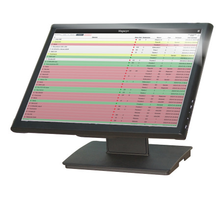
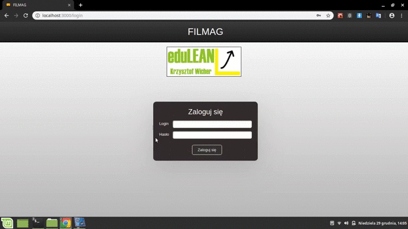
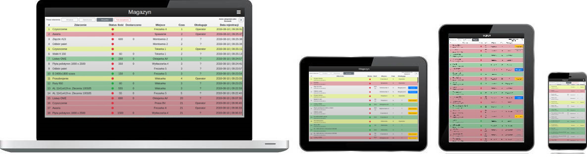

# --- FILMAG ---
Aplikacja dla branży produkcyjnej.
 
Cel: gromadzenie i przekazywanie zgłoszeń od operatorów maszyn.

    

### Demo:
Wersja demonstracyjna: [https://filmag-demo.herokuapp.com](https://filmag-demo.herokuapp.com)
 
Loginy: Operator, Magazynier, Kierownik, Prezes.
 
Hasło: 12345
 
 

### Zalety aplikacji:
- wiele rozwiązań zabezpieczających aplikację i dane,
- łatwy dostęp do bieżących i zakończonych zadań,
- prosta obsługa ułatwia wprowadzanie danych na maszynach i wózkach widłowych,
- szczegółowe informacje o zdarzeniach,
- odliczanie czasu jaki upłynął od zgłoszenia,
- szybkie sortowanie po lokalizacjach,
- oznaczenia kolorami, np. awaria - czerwone tło, przezbrojenie - żółte tło,
- działa online,
- panel ustawień dla osób zarządzających,
- zabezpieczenia zmian uprawnień użytkowników wg hierarchii pracowników firmy,
- przyjazny interfejs dostępny na różnej wielkości ekranach - sześciostopniowy podział RWD, 
- możliwość pobrania danych historycznych do pliku .xlsx.
 

## UŻYTE TECHNOLOGIE

 

#### **_Ponadto_**
 

Frontend:
- joi-browser - walidacja wprowadzanych danych,
- przyspieszenie renderowania strony przez użycie bibliotek react-window i react-virtualized-auto-sizer,
- użycie Gulp.js do kompilowania stylów CSS z .scss,
- stosowanie plików .env dla środowisk development i production (inne bazy danych, inne adresy API node),
- zastosowanie react-confirm-alert z własnymi stylami okienek,
- dodatkowe biblioteki pomocnicze: axios, react-toastify, file-saver, bootstrap, font-awesome, lodash.
 

Backend:
- własna aplikacja napisana w Node.js / express,
- stosowanie funkcji typu middleware, np. do autorzyacji czy sprawdzania czasu ostatniej aktywności,
- baza danych - mongoDB, mongoose, tworzenie modeli danych i zapytania,
- redukcja zapytań do DB przez zapisywanie wyników w cache,
- bezpieczna i szybka autoryzacja użytkowników z użyciem JWT,
- interfejsy API wg zasobów, np. api/tasks, api/users,
- @hapi/joi - walidacja przychodzących danych,
- podział struktury kodu, tzn. osobno routes, models, middlewares, startup files.
- dodatkowe biblioteki pomocnicze: compression, cors, helmet, lodash, xlsx, nodemailer, googleapis, config,
  zip-a-folder, memory-cache,
- demo kodu dostępne na osobnym repozytorium.
 

Zabezpieczenia:
- wymuszenie stosowania protokołu https, tj. automatyczne przekierownaie http -> https,
- użycie biblioteki bcrypt do kodowania haseł,
- przechowywanie wrażliwych danych w zmiennych środowiskowych na serwerze,
- cykliczny, automatyczny backup bazy danych na Google Drive,
- zastosowanie standardu JSON Web Token do autoryzacji użytkownika,
- ustawienie headers przez zastosowanie bilbioteki helmet,
- użycie biblioteki CORS ze wskazaniem akceptowanego origin,
- wymuszenie wylogowania użytkownika po dłuższej nieaktywności (w tym kasowanie localStorage),
- sanityzacja danych; domyślne działanie biblioteki ReactJS,
- walidacja wprowadzanych danych przez użytkownika i odbieranych przez serwer,
- blokada loginu na określony czas przy trzech nieudanych próbach logowania,
- odmowa dostępu do chronionych ścieżek URL, gdy użytkownik nie ma uprawnień (frontend i backend),
- instalacja aplikacji react i node na heroku.com,
- wybór serwisu MongoDB Atlas do przechowywania bazy danych.

 

## OPIS I PREZENTACJA
### **_1. Logowanie._**
Etap logowania jest zależny od rodzaju wykonywanej pracy przez użytkownika. System automatycznie rozpoznaje, który rodzaj ma rozpocząć.
- operator -> logowanie - wybór maszyny - wyświetlenie danych tylko dla danej maszyny, 
- magazynier -> logowanie - wybór magazynu - przejście do widoku magazynu,
- osoba zarządzająca (kierownik, prezes, itp.) -> logowanie - przekierowanie na widok magazynu (wszystkie zdarzenia).

### **_2. Obsługa programu - operator._**
Użytkownik posiadający uprawnienia operatora może:
- zgłaszać i zamykać zlecenia do magazynu,
- informować o postojach (awarie, czyszczenie) i zakończeniu zadań.

### **_3. Obsługa programu - magazynier._**
Użytkownik magazynier może:
- zadeklarować przyjęcie zlecenia,
- przejąć zlecenie od innego magazyniera,
- zgłaszać częściowe dostawy, np. dostarczono 200 szt. z 2500 szt.

### **_4. Obsługa programu - osoba zarządzająca._**
Użytkownik zadeklarowany jako osoba zarządzająca (mistrz zmiany, kierownik, dyrektor, prezes) ma możliwość:
- zgłoszenia i zamknięcia zlecenia na daną maszynę,
- przełączania między widokami danych maszyn i magazynów,
- dostęp do ustawień lokalizacji,
- zmiany uprawnień pozostałym użytkownikom - z zastrzeżeniem że tylko tym, którzy są niżej w hierarchii firmy. \*

\* Przykładowo kierownik może zmienić uprawnienia operatora, magazyniera czy mistrza, lecz nie może innemu kierownikowi czy dyrektorowi.

### **_5. Obsługa programu - konto wspóldzielone._**
W przypadku sytuacji gdy wielu operatorów ma korzystać z jednego komputera, należy wykorzystać współdzielone konto.
Takie konto umożliwia identyfikację pracowników po kodzie ID i PIN, które są przydzielane do każdego użytkownika.
 
Przebieg:
- zalogowanie się jako konto wspólne (login + hasło),
- przy zgłasaniu zdarzeń należy podać kod ID oraz PIN,
- dzięki temu nie pomija sie operacje wylogowania i logownia za każdym razem, gdy inny pracownik chce zgłosić zdarzenie.

### **_5. Przyjazny interfejs na różnej wielkości ekranach._**
Aplikacja jest w pełni responsywna.

 

## UWAGI
Jest to demonstracyjne repozytorium, tzn. posiada tylko część kodu.

